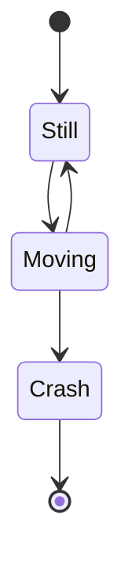
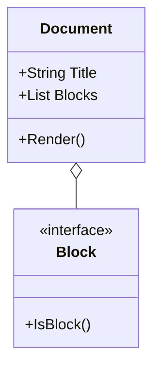

# DocGen Showcase

Dieses Dokument zeigt die vielfältigen Möglichkeiten von **DocGen**.

## 1. Tabellen
Tabellen werden nun vollständig unterstützt und automatisch an die Seitenbreite angepasst.

| Feature | Status | Beschreibung |
| :--- | :--- | :--- |
| PDF Export | ✓ | Hochqualitative PDF Erzeugung |
| Mermaid | ✓ | Flussdiagramme, Sequenzdiagramme, etc. |
| Custom Themes | ✓ | JSON-basierte Code Themes |
| Margins | ✓ | Einstellbare Seitenränder |

## 2. Diagramme (Verschiedene Typen)

### 2.1 Zustandsdiagramm


### 2.2 Klassendiagramm


## 3. Code & API Dokumentation
DocGen eignet sich hervorragend für technische Dokumentationen.

```go
// Document API Beispiel
type Document struct {
    Title    string
    Blocks   []Block
    Settings Config
}

func (d *Document) AddBlock(b Block) {
    d.Blocks = append(d.Blocks, b)
}
```

## 4. Listen & Formatierung
- **Fettgedruckter Text** für Hervorhebungen.
- *Kursiver Text* für Anmerkungen.
- `Inline Code` für Variablennamen.

1. Erster Schritt
2. Zweiter Schritt
   - Unterpunkt A
   - Unterpunkt B
