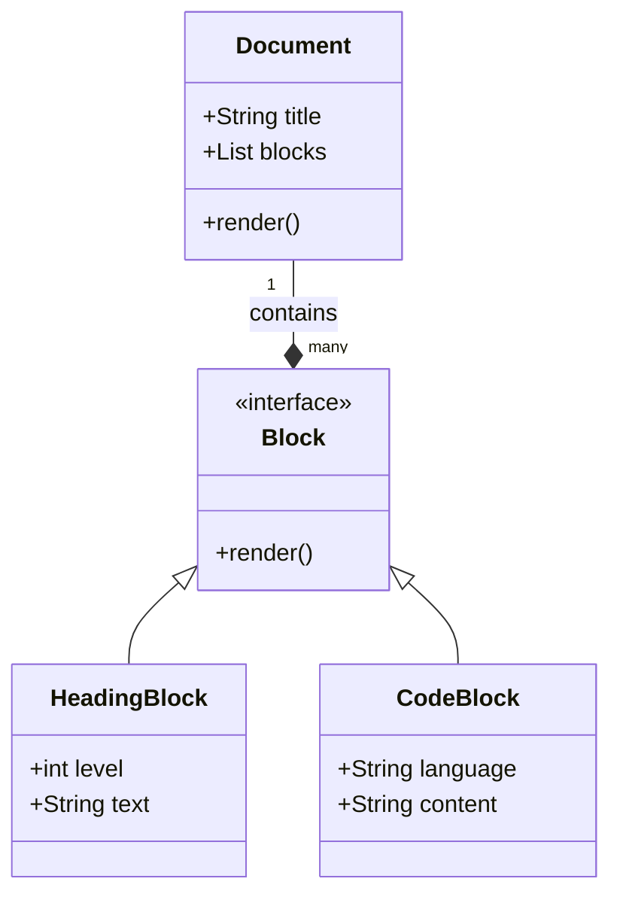
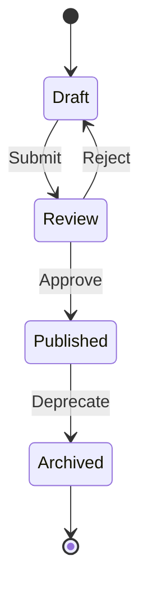

# API Dokumentation & Showcase

## REST API Übersicht

Die folgende Tabelle beschreibt die Kern-Endpoints unserer API:

| Methode | Endpoint | Beschreibung | Authentifizierung |
|---------|----------|--------------|-------------------|
| `GET` | `/v1/docs` | Listet alle Dokumente | Ja |
| `POST` | `/v1/docs` | Erstellt ein neues Dokument | Ja (Admin) |
| `GET` | `/v1/docs/{id}` | Details zu einem Dokument | Ja |
| `DELETE` | `/v1/docs/{id}` | Löscht ein Dokument | Ja (Admin) |

## Datenmodell

Wir nutzen JSON für den Datenaustausch. Hier ein Beispiel für ein Dokumenten-Objekt:

```json
{
  "id": "doc_123",
  "title": "Jahresbericht 2025",
  "status": "published",
  "author": {
    "name": "Max Mustermann",
    "role": "Editor"
  },
  "tags": ["Finanzen", "Intern"]
}
```

## System-Architektur

Das folgende Klassendiagramm zeigt die interne Struktur des DocGen Systems:



## Status-Übergänge

Der Lebenszyklus eines Dokuments wird durch dieses State-Diagramm verdeutlicht:


