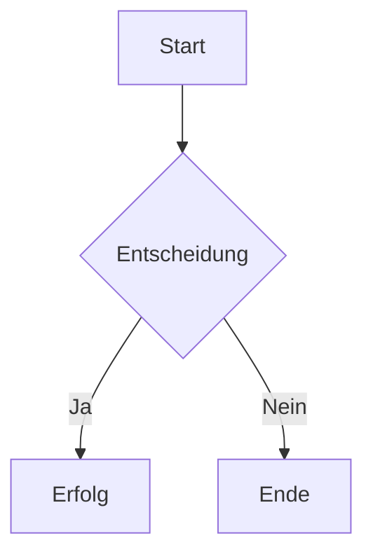

# Einführung

Dies ist ein Beispiel-Dokument, das mit dem **DocGen** Tool erstellt wurde. 
Es unterstützt *Markdown*, **fette Schrift**, *kursive Schrift* und vieles mehr.

## Mermaid Diagramm



## Code Beispiel

Hier ist ein einfaches Go Programm:

```go
package main

import "fmt"

func main() {
    fmt.Println("Hallo Welt!")
}
```

## Listen

- Punkt 1
- Punkt 2
  - Unterpunkt
- Punkt 3

1. Erster Schritt
2. Zweiter Schritt
