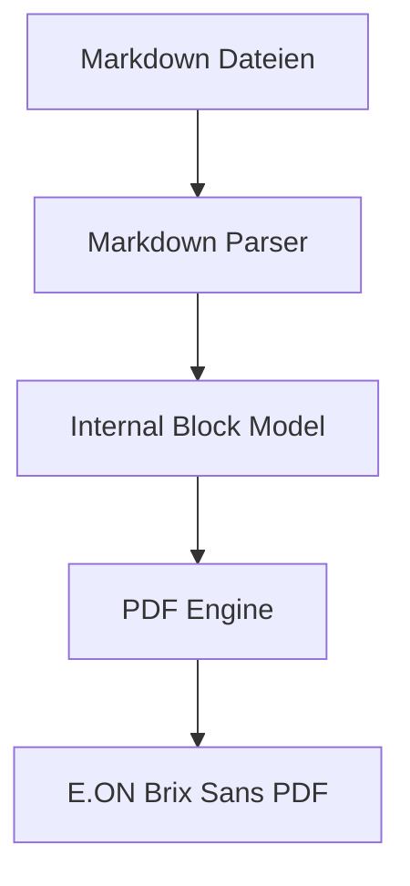
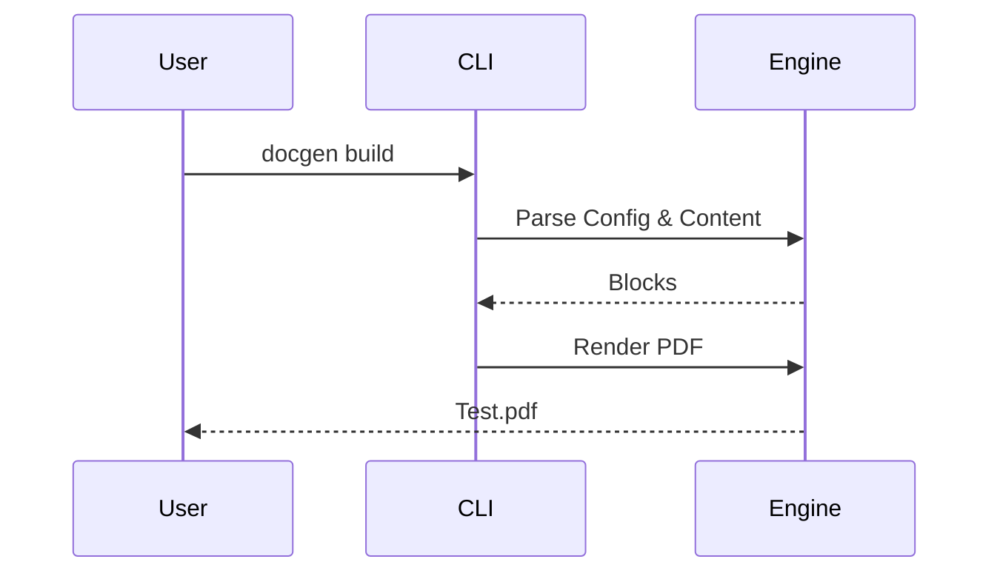

# Diagramme und Visualisierung

In diesem Abschnitt werden die Diagramm-Fähigkeiten des PDF-Generators demonstriert. Wir nutzen Mermaid.js für die Erstellung von Diagrammen direkt aus dem Markdown.

## Flussdiagramm

Hier ist ein einfaches Flussdiagramm, das den Prozess der PDF-Erstellung zeigt:

## Sequenzdiagramm

Ein Beispiel für ein Sequenzdiagramm:

